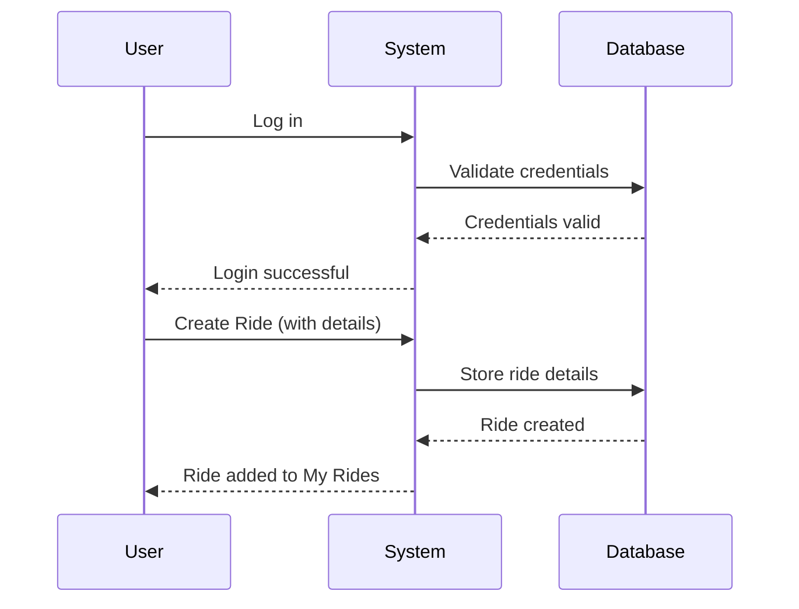
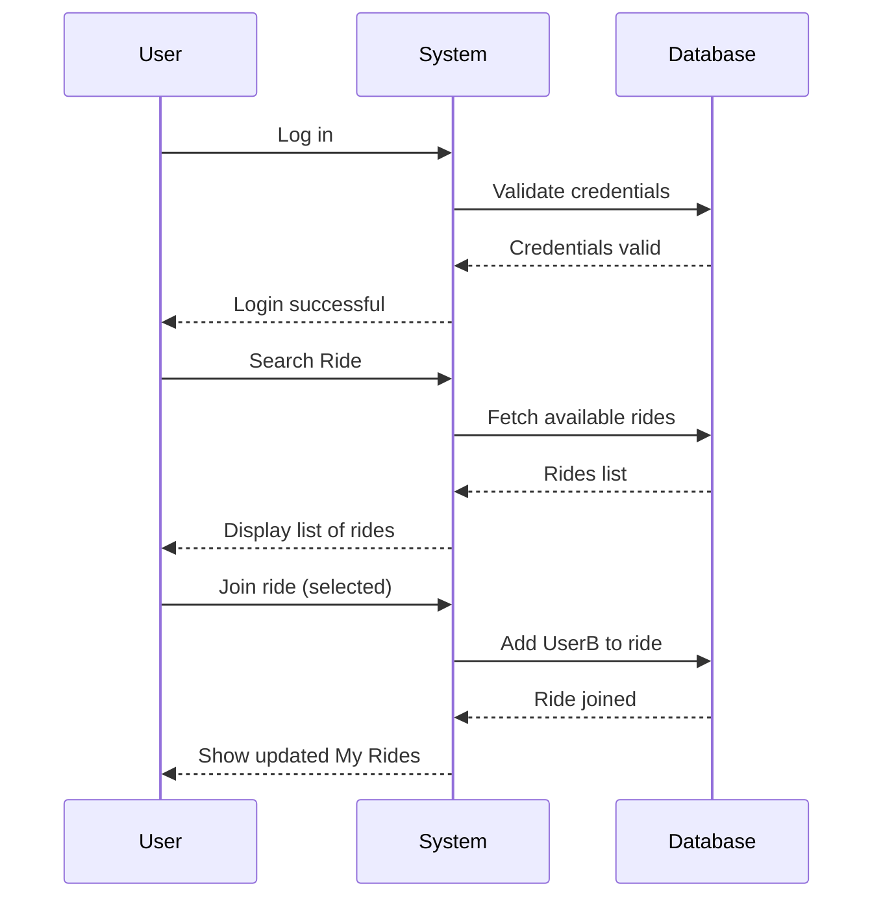
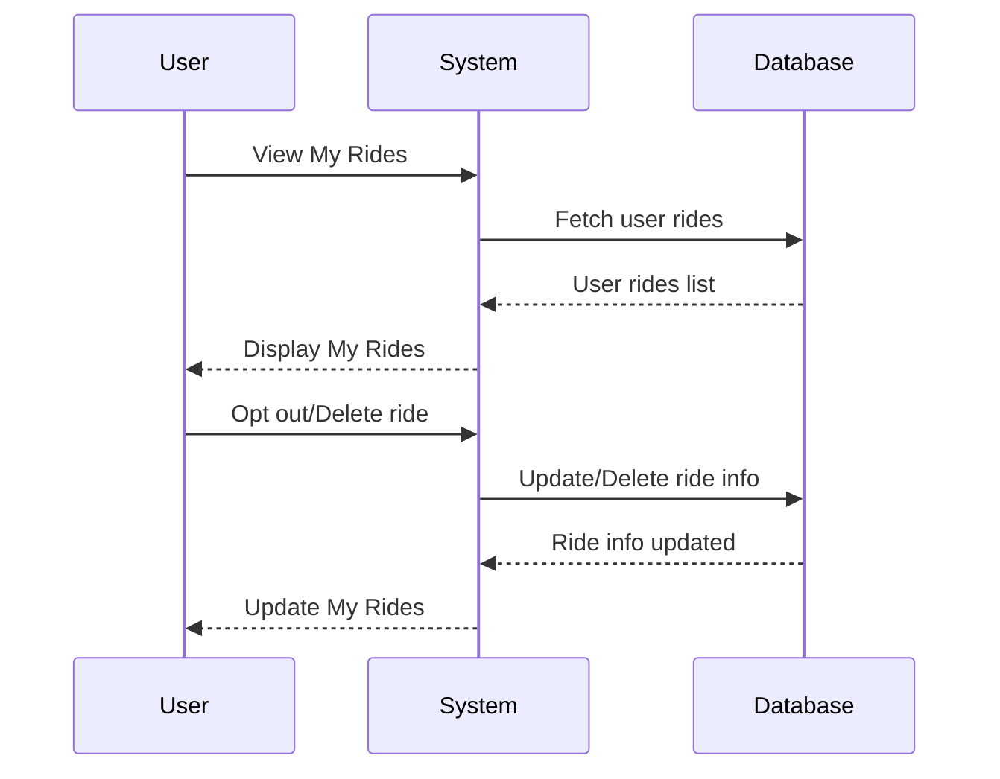

Here are the three sequence diagrams broken down based on your requirements:

### 1) User Logging In and Creating a Ride

### 2) Different User Logging In, Searching for a Ride, and Joining

### 3) User Opting Out / Deleting a Ride

